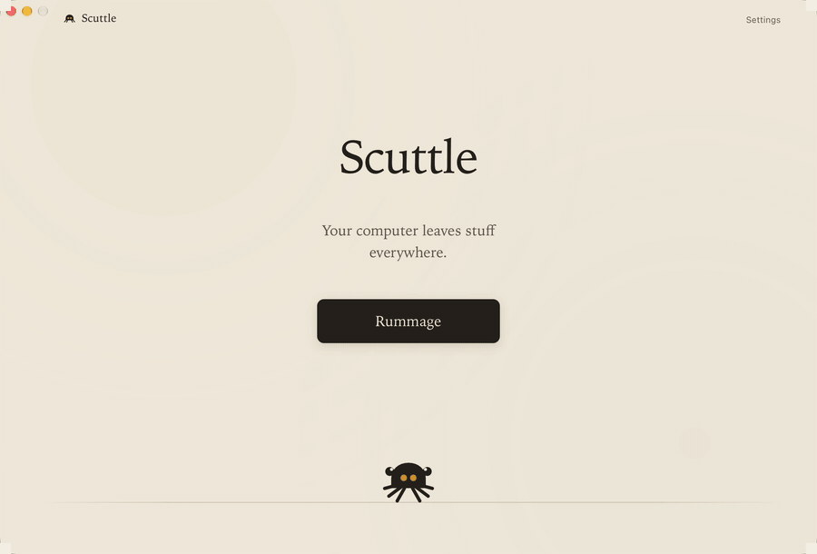

<div align="center">


# Scuttle

**Your computer leaves stuff everywhere. Scuttle finds it.**

[](https://github.com/acltabontabon/scuttle/actions/workflows/ci.yml)
[](LICENSE)
[](https://github.com/acltabontabon/scuttle/releases)
[](#platform-support)

**[scuttle on the web →](https://acltabontabon.com/scuttle/)**

</div>



Scuttle is a desktop utility that rummages through the forgotten corners of your
computer and shows you what turned up:

- apps that left files behind
- forgotten screenshots
- installers you probably don't need any more
- duplicates
- abandoned caches
- giant mystery files
- assorted digital oddments

Scuttle tells you **why** something looks disposable before asking you to do
anything about it. Most of what a rummage finds is yours to keep — the point is
to see it, not to sweep it.

No accounts. No cloud scanning. No "boost your PC" nonsense.

---

## Download

| Your computer | Download |
| --- | --- |
| **Mac**, Apple silicon (M1 and later) | [`.dmg`](https://github.com/acltabontabon/scuttle/releases) |
| **Mac**, Intel | [`.dmg`](https://github.com/acltabontabon/scuttle/releases) |
| **Windows** 10 or 11, 64-bit | [`-setup.exe`](https://github.com/acltabontabon/scuttle/releases) |

All three are on the [releases page](https://github.com/acltabontabon/scuttle/releases),
each with a `.sha256` file beside it. Not sure which Mac you have? Apple menu →
About This Mac; "Apple M1" or later means Apple silicon.

The current build is **`v0.1.0-alpha.1`**, an alpha. It does what this page
describes and its tests pass on macOS and Windows, but it has not been run on
many machines yet — so give the drawer a look before you empty it.

### Installing

Scuttle is built without paid code-signing certificates: it is **not signed with
an Apple Developer ID and not notarized** on macOS, and the Windows installer is
**unsigned**. Neither operating system can tell you who made it, so both will say
so the first time. Here is what you will see, and what to do.

**macOS.** Open the `.dmg` and drag Scuttle to Applications, then open it from
Applications. You will be told the developer cannot be verified. Go to **System
Settings → Privacy & Security**, scroll down to **Security**, and click **Open
Anyway** next to Scuttle, then open the app again. That button only appears
after you have tried to open the app, and only for about an hour afterwards, so
if you have wandered off and come back, try opening Scuttle once more first. You
do this once.

The macOS builds are *ad-hoc* signed, which is what lets an Apple silicon build
launch at all. Ad-hoc signing is not a verified publisher identity and it is not
notarization — it only means the bundle is internally consistent. If macOS tells
you Scuttle is **damaged** rather than unverified, that is not the same prompt
and it is not something to click past: the download is broken or was tampered
with. Check it against its `.sha256`, download it again, and
[open an issue](https://github.com/acltabontabon/scuttle/issues) if it persists.

**Windows.** Run the `-setup.exe`. Microsoft Defender SmartScreen will say it
prevented an unrecognised app from starting: click **More info**, then **Run
anyway**. Scuttle installs for your user account only, so Windows will not ask
for an administrator password. You will see this warning again on future
versions — SmartScreen's reputation is per file, and an unsigned project never
accumulates any.

Please don't switch off Gatekeeper, SmartScreen or your antivirus to install
this, or anything else. Nothing above asks you to change a system setting.

---

## What it actually does

You press **Rummage**. Scuttle walks the places software leaves things — your
Downloads folder, the Desktop, application support and cache directories,
screenshot folders, Steam and Epic libraries — and comes back with what it
noticed, grouped into piles you can dig through.

Every finding carries its evidence:

```
Cyberpunk 2077                                            6.40 GB

Steam has no installation of Cyberpunk 2077.
6.40 GB stayed behind, untouched for 142 days.

Why Scuttle noticed
  ✓ Steam has no installation of Cyberpunk 2077
  ✓ Untouched for 142 days
  ✓ Contents look generated — 91% of it is cache and log files
  ✓ Nothing appears to be using it

Confidence: High          Risk: Low

  Reveal        Keep        Put in the drawer
```

And when Scuttle isn't sure, it says so:

```
Scuttle has no idea what this is.

You decide.
```

Open a pile and you get every file in it, each one tickable, with a running
total of what you have picked. Scuttle marks its own suggestions, and you are
free to ignore them — a finding is something noticed, not something condemned.

## The drawer

Nothing is ever deleted as a side effect of anything else.

**Putting something in the drawer** moves it into a holding folder inside
Scuttle's own data directory and writes down where it came from, both in its
database and in a plain manifest beside the item. The file is out of your way
but still on the disk.

**Putting it back** returns it to exactly where it was. If the folder it lived
in has since been deleted, Scuttle recreates it. If something else has since
taken its name, Scuttle restores it alongside rather than over the top, and
tells you it did.

**Emptying the drawer** is the only thing that frees space, and the only thing
that destroys data. Items do not go to the Trash or the Recycle Bin, which is
what the confirmation says before you confirm it. Anything you leave in the
drawer expires after a window you choose (7, 14 or 30 days) and is removed the
next time Scuttle starts.

## What it won't do

- It won't invent problems. A scan of a tidy machine comes back quiet.
- It won't call a file junk because it's old. Age alone never reaches high
  confidence.
- It won't delete anything as a side effect. Things move into a drawer first,
  and stay recoverable.
- It won't go near your keys, your password vault, your browser profiles, your
  mail, your repositories or your cloud-sync folders. Those directories aren't
  just excluded from results — they're never walked at all.
- It won't show you a health score, a fake urgency counter, or a percentage
  with three decimal places.

## Two ideas that do most of the work

**Confidence and risk are different things.** Scuttle can be *completely
certain* that a 40 GB archive hasn't been touched in two years and still have
no business suggesting you delete it. Confidence is about classification; risk
is about what it costs if Scuttle is wrong. A finding is only ever proposed for
cleanup when confidence is high *and* being wrong would be cheap.

**A finding is a request, not an authorisation.** The interface can ask to
quarantine something, but the Rust core re-derives every decision against the
live filesystem first: does the path still exist, is it still the same size and
shape, does it pass through a symlink, is it protected, is it inside the area
you asked Scuttle to look at? If anything moved between the scan and the
action, Scuttle refuses and asks you to rummage again.

## It stays on your machine

There is no account, no sign-in and no server. Scuttle makes no network requests
of its own: the only thing that ever goes over the network is the WebView2
installer on the rare Windows machine that doesn't already have it, and that is
Microsoft's, not Scuttle's. Findings, settings and drawer records live in one
SQLite database in Scuttle's own directory on the machine that made them, and
full paths are never written to logs.

There is deliberately **no automatic updater**, so Scuttle never calls home to
ask whether it is out of date. New versions come from
[the releases page](https://github.com/acltabontabon/scuttle/releases) when you
go and get them.

`scuttle --dry-run` in a terminal prints everything Scuttle would classify and
what it would recommend, and changes nothing. It's the one place full paths are
shown, and it's the quickest way to see what a rummage would say before you run
one.

## Platform support

| Platform | Status | Notes |
| --- | --- | --- |
| macOS 11+ (Apple silicon) | Supported | App bundles, Steam and Epic libraries, `~/Library` layout |
| macOS 10.15+ (Intel) | Supported | Same, on an Intel build |
| Windows 10+ | Supported | Uninstall registry (both views), Steam and Epic libraries, `AppData` layout |
| Linux | Not yet | The platform layer is a stub that knows nothing about a Linux system, so there is no Linux download |

Scuttle asks for no special permissions. On macOS that means folders needing
Full Disk Access are skipped rather than requested, and counted as places that
could not be read. On Windows, a drawer on a different drive from the thing
being held turns the move into a copy, which needs room for both copies while it
runs — most likely to come up with a Steam library on a second disk.

## Development

Rust via [rustup](https://rustup.rs) and [Node](https://nodejs.org) 22+:

```sh
git clone https://github.com/acltabontabon/scuttle
cd scuttle
npm install
npm run app:dev       # the app, with the frontend hot-reloading
npm run check         # everything CI runs, in one command
npm run app:build     # a .dmg on macOS, a -setup.exe on Windows
```

[`docs/development.md`](docs/development.md) has the platform prerequisites and
the design workbench at `/preview.html`. [`docs/releasing.md`](docs/releasing.md)
is the release process; [`docs/packaging.md`](docs/packaging.md) is what actually
goes into a build.

The site at [acltabontabon.com/scuttle](https://acltabontabon.com/scuttle/) is
in [`www/`](www), with its own dependencies so none of it reaches the
application — `npm --prefix www run dev` to work on it, and
[`docs/website.md`](docs/website.md) for the rest.

## Documentation

- [Architecture](docs/architecture.md) — how the pieces fit together
- [Safety model](docs/safety.md) — what stops Scuttle deleting your thesis
- [Writing a detector](docs/writing-a-detector.md)
- [Privacy](docs/privacy.md) — what's stored, what's logged, what never leaves
- [Development](docs/development.md) · [Packaging](docs/packaging.md) ·
  [Releasing](docs/releasing.md) · [Website](docs/website.md)
- [Docker](docs/docker.md) — why there isn't an image
- [Changelog](CHANGELOG.md)

## Contributing

Yes please — especially detectors, and especially protected-path rules for
software we haven't thought of. Read
[CONTRIBUTING.md](CONTRIBUTING.md) first; the short version is that anything
touching the safety layer needs tests that demonstrate the failure it prevents.

Security concerns go through [SECURITY.md](SECURITY.md).

## Support

Scuttle is free and always will be. If it found something you were glad to get
back, you can [buy me a coffee](https://ko-fi.com/aclt_attic) — entirely
optional, and it buys you nothing but goodwill.

## Licence

Apache 2.0. See [LICENSE](LICENSE) and
[the reasoning](docs/architecture.md#why-apache-20).
