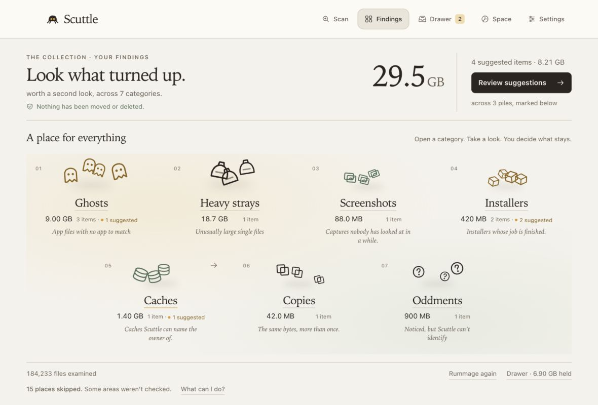
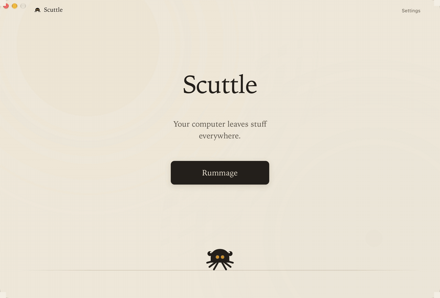
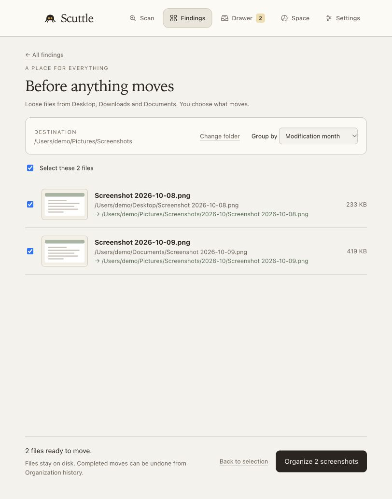

<div align="center">


# Find what’s out of place.<br>Decide where it belongs.

**Scuttle helps you make room, gather scattered files, and understand what’s on your computer.**

A small desktop companion for macOS and Windows. No account. No cloud scanning. You stay in charge.

[**Download Scuttle →**](https://github.com/acltabontabon/scuttle/releases/latest) · [See the website](https://acltabontabon.com/scuttle/) · [How it works](#a-rummage-not-a-rush)

[](https://github.com/acltabontabon/scuttle/actions/workflows/ci.yml)
[](https://github.com/acltabontabon/scuttle/releases)
[](LICENSE)

</div>



## Less clutter. More say.

Downloads accumulate. Screenshots scatter. Apps leave things behind. Scuttle
rummages through the places they collect and brings back a few understandable
piles—with the evidence you need to decide what happens next.

| Give things a home | Make room thoughtfully | Know what you’re looking at |
| --- | --- | --- |
| Gather loose screenshots into monthly folders and collect installers in one place. Preview every move and undo it from history. | Review old installers, duplicates, caches, and app leftovers. Put them in a recoverable drawer before removal. | See why each file turned up, what moving it could affect, and where your storage went. |

**New in 0.2.0: Give things a home.** Organize screenshots and installers, browse
a refreshed Findings screen, and inspect developer dependency caches.
[Explore the release →](https://github.com/acltabontabon/scuttle/releases/tag/v0.2.0)

## A rummage, not a rush

**1. Look around.** Press **Rummage**. Scuttle checks familiar places such as
Downloads and Desktop, then groups what it finds into piles.

**2. Take a look.** Open a pile. Read why something turned up. Choose what to
keep, organize, or put in the drawer.

**3. Give it a home—or give yourself time.** Organize files into folders you
choose. Hold cleanup candidates in the drawer until you’re ready to let them
go. Nothing moves just because a scan found it.



## A place for the things you want to keep

A screenshot doesn’t have to be old to be out of place. **Organize…** gathers
loose screenshots and installers from Desktop, Downloads, and Documents without
taking apart your existing folders.

- **Screenshots, together.** Group by modification month, or keep everything in
  one folder. Thumbnails help you recognize what you’re moving.
- **Installers with a home.** Collect the downloads you want to keep, with their
  original filenames.
- **Preview before moving.** Choose the destination and see every before-and-after
  path. Name collisions get a visible suffix; existing files are never overwritten.
- **Undo you can find later.** Organization history survives a restart. Undo
  checks the files again and leaves edited files and occupied original paths alone.



Organizing keeps files on disk. It clears your workspace, not your storage.
[Explore organization →](docs/organizing.md)

## Cleanup with a way back

Scuttle explains what it noticed: an app that’s gone, a newer installer nearby,
a cluster of similar screenshots, or a cache that hasn’t changed in months.
When it doesn’t know, it says so.

The **Drawer** gives you room to decide. Items stay recoverable, and putting
something there doesn’t free disk space. Permanent removal is a separate action;
eligible rebuildable items can expire after the retention window you choose.
Your personal files stay until you explicitly remove them.

[How the drawer works →](docs/using-scuttle.md#the-drawer)

## Useful around a developer’s desk

Opt in to finding old build output from common development workspaces. Scuttle
checks project markers, repository state, and relevant running tools before
suggesting verified Cargo, Next.js, or .NET output.

A separate **dependency cache preview** helps you inspect Maven, Gradle, npm,
pnpm, and Yarn stores, with known project references and reasons entries are
preserved. This preview is read-only; it does not remove dependencies.

[Developer features →](docs/using-scuttle.md#developer-build-output)

## Quiet by choice. Local by design.

- **Your files stay yours.** Scanning and classification happen on your machine.
  There’s no account or upload service.
- **No manufactured urgency.** No health score, “boost your PC” promise, or junk
  verdict based only on a file’s age.
- **Boundaries that matter.** Credentials, browser profiles, cloud-sync folders,
  and other protected locations are left alone.
- **Background work is optional.** Menu bar mode, background checks, and
  notifications are separate opt-ins. Background checks move nothing.
- **Updates on your terms.** Scuttle can check GitHub for new releases; downloads
  and installation wait for your choice.

[Privacy](docs/privacy.md) · [Safety model](docs/safety.md) · [Background mode](docs/using-scuttle.md#staying-in-the-menu-bar)

## Bring Scuttle home

| Platform | Download |
| --- | --- |
| macOS · Apple silicon | [Latest `.dmg`](https://github.com/acltabontabon/scuttle/releases/latest) |
| macOS · Intel | [Latest `.dmg`](https://github.com/acltabontabon/scuttle/releases/latest) |
| Windows 10 / 11 · 64-bit | [Latest `-setup.exe`](https://github.com/acltabontabon/scuttle/releases/latest) |

Free and open source. macOS 11+ on Apple silicon, macOS 10.15+ on Intel.
Linux is not supported yet.

**First-time installation:** macOS builds are ad-hoc signed and not notarized;
Windows installers are unsigned. Your OS may show a warning.
[Read the installation steps](docs/installing.md) before opening the download.

## Built in the open

Scuttle uses Rust, Tauri, and React. To run the current source, install Rust
1.89+ and Node 22.12+ (or 24+), then:

```sh
git clone https://github.com/acltabontabon/scuttle
cd scuttle
npm ci
npm run app:dev
```

`npm run check` runs the repository checks. See the
[development guide](docs/development.md) for platform prerequisites and the
browser design workbench.

[Architecture](docs/architecture.md) · [User guide](docs/using-scuttle.md) ·
[Write a detector](docs/writing-a-detector.md) · [Packaging](docs/packaging.md) ·
[Releasing](docs/releasing.md) · [Website](docs/website.md) · [Why no Docker image?](docs/docker.md)

Contributions are welcome—especially detectors and protection rules for software
Scuttle hasn’t met. Start with [CONTRIBUTING.md](CONTRIBUTING.md). Report security
concerns through [SECURITY.md](SECURITY.md).

Scuttle is free. If it helped, you can [buy me a coffee](https://ko-fi.com/aclt_attic).
Licensed under [Apache 2.0](LICENSE).
